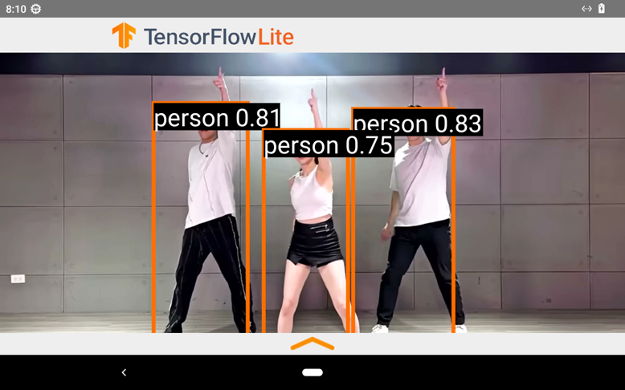

# object_detect - Object Detection Demo Application

## Overview

The object_detect application uses TensorFlow Lite to perform object detection on video input from the HDMI-IN source of the Nexcom VMC320 vehicle mount computer. It showcases the machine's ability to process and identify objects in real-time.

## Features

- **Object Detection:** Uses TensorFlow Lite to detect objects in real-time.
- **HDMI-IN Source:** Processes video input from an HDMI source.
- **Real-time Processing:** Displays detected objects on the video feed.

## Screenshot

## Getting Started

1. Clone the repository: `git clone https://github.com/mcsnexcom/VMC320.Android.git`
2. Navigate to the object_detect directory: `cd VMC320.Android/object_detect`
3. Open the project in Android Studio.
4. Build and run the application on your VMC320 device.

## Usage

- Connect an HDMI source to the VMC320 device.
- Launch the object_detect app to start the object detection demo.
- Observe the detected objects highlighted on the video feed.

## Contributing

Contributions are welcome! Please fork the repository and submit pull requests for any improvements or bug fixes.

