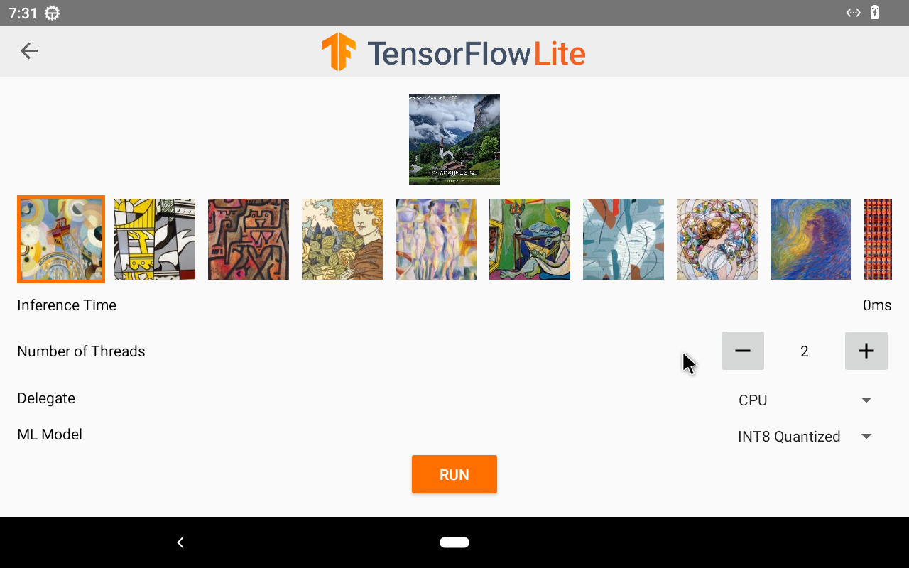

# style_transfer - HDMI-IN Style Transfer Application

## Overview

The style_transfer application captures video input from the HDMI-IN source of the Nexcom VMC320 vehicle mount computer and applies various artistic styles to the captured images. This demo showcases the capability of performing style transfer using advanced neural network techniques.

## Features

- **HDMI-IN Video Capture:** Captures video input from an HDMI source.
- **Style Transfer:** Applies different artistic styles to the captured images.
- **Real-time Processing:** Processes and displays styled images in real-time.

## Screenshot

## Getting Started

1. Clone the repository: `git clone https://github.com/mcsnexcom/VMC320.Android.git`
2. Navigate to the style_transfer directory: `cd VMC320.Android/style_transfer`
3. Open the project in Android Studio.
4. Build and run the application on your VMC320 device.

## Usage

- Connect an HDMI source to the VMC320 device.
- Launch the style_transfer app to start capturing video.
- Apply various styles to the captured images using the provided controls.
- View the styled images in real-time.

## Contributing

Contributions are welcome! Please fork the repository and submit pull requests for any improvements or bug fixes.

