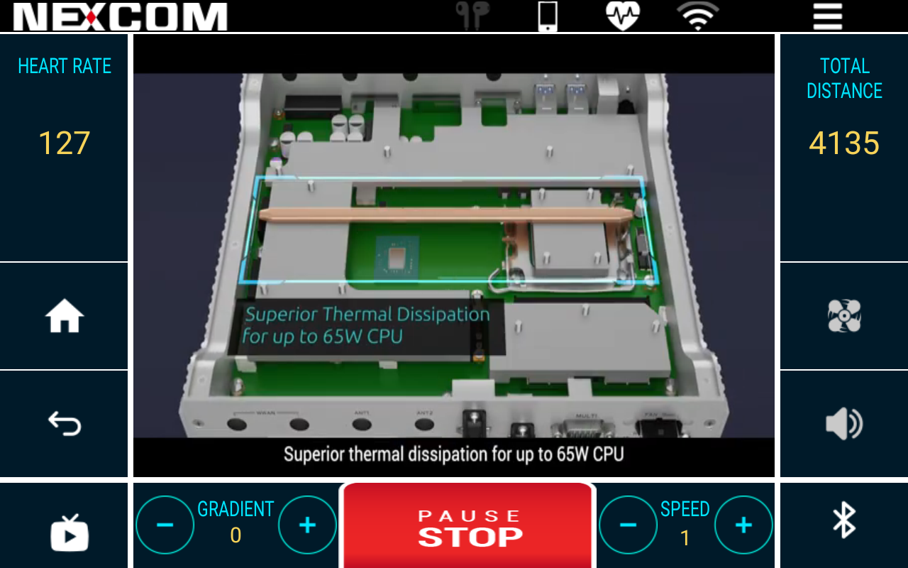

# UFC100

## Overview

UFC100 is an Android application designed to simulate the interface of a treadmill head unit. This app offers various controls and simulations, including different video playback speeds, app calls, Bluetooth, and sound controls.

## Features

- **Video Playback Speed Control**: Simulate different speeds of video playback to match the treadmill's operation.
- **App Call Integration**: Allows for seamless integration with other apps.
- **Bluetooth Control**: Manage and control Bluetooth connections for a comprehensive user experience.
- **Sound Control**: Adjust and simulate different sound settings to enhance the simulation.

## Screenshot




## Getting Started

### Prerequisites

- Android device running version 5.0 (Lollipop) or higher.
- Bluetooth-enabled device for Bluetooth control features.

### Installation

1. Clone the repository:
    ```bash
    git clone https://github.com/mcsnexcom/VMC320.Android.git
    ```
2. Open the project in Android Studio.
3. Build and run the app on your Android device.

## Usage

1. **Video Playback Speed**: Use the on-screen controls to adjust the playback speed of videos.
2. **App Call Integration**: Connect and interact with other applications through the app's interface.
3. **Bluetooth**: Pair your device with other Bluetooth-enabled devices and control the connection.
4. **Sound**: Adjust volume and other sound settings directly from the app.

## Contributing

We welcome contributions to UFC100! To contribute:

1. Fork the repository.
2. Create a new branch (`git checkout -b feature-branch`).
3. Make your changes.
4. Commit your changes (`git commit -m 'Add some feature'`).
5. Push to the branch (`git push origin feature-branch`).
6. Open a merge request.

## License

UFC100 is released under the [MIT License](LICENSE).


