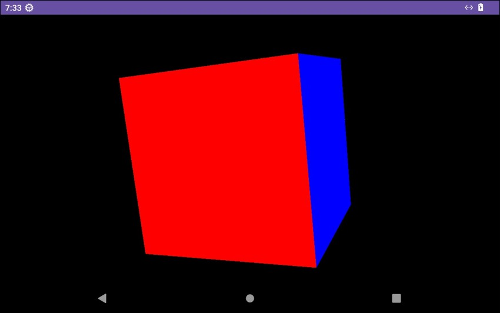

# gsensor-lsm6ds - G-Sensor Demo Application

## Overview

The gsensor-lsm6ds application demonstrates the G-sensor capabilities of the Nexcom VMC320 vehicle mount computer. It uses a 3D cube to visually represent the rotation along the x, y, and z axes.

## Features

- **3D Cube Visualization:** Displays a 3D cube that rotates based on the G-sensor readings.
- **Axis Rotation:** Shows real-time rotation along the x, y, and z axes.

## Screenshot

## Getting Started

1. Clone the repository: `git clone https://github.com/mcsnexcom/VMC320.Android.git`
2. Navigate to the gsensor-lsm6ds directory: `cd VMC320.Android/gsensor-lsm6ds`
3. Open the project in Android Studio.
4. Build and run the application on your VMC320 device.

## Usage

- Launch the gsensor-lsm6ds app to start the G-sensor demo.
- Observe the 3D cube rotating in response to the device's movements.

## Contributing

Contributions are welcome! Please fork the repository and submit pull requests for any improvements or bug fixes.

