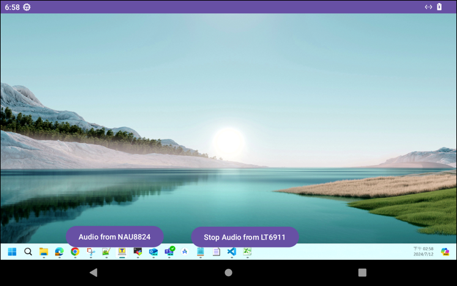

# lt6911_preview - HDMI-IN and Audio Source Demo

## Overview

The lt6911_preview application demonstrates the HDMI-IN functionality and audio source capabilities of the Nexcom VMC320 vehicle mount computer. It supports video preview from HDMI-IN and audio capture from HDMI-IN and the built-in microphone.

## Features

- **HDMI-IN Video Preview:** Displays video input from an HDMI source.
- **Audio Capture:** Captures audio from HDMI-IN and the built-in microphone.
- **Audio Source Switching:** Switch between different audio sources.

## Screenshot

## Getting Started

1. Clone the repository: `git clone https://github.com/mcsnexcom/VMC320.Android.git`
2. Navigate to the lt6911_preview directory: `cd VMC320.Android/lt6911_preview`
3. Open the project in Android Studio.
4. Build and run the application on your VMC320 device.

## Usage

- Connect an HDMI source to the VMC320 device.
- Launch the lt6911_preview app to start the HDMI-IN video preview.
- Use the provided controls to switch between audio sources.

## Contributing

Contributions are welcome! Please fork the repository and submit pull requests for any improvements or bug fixes.

