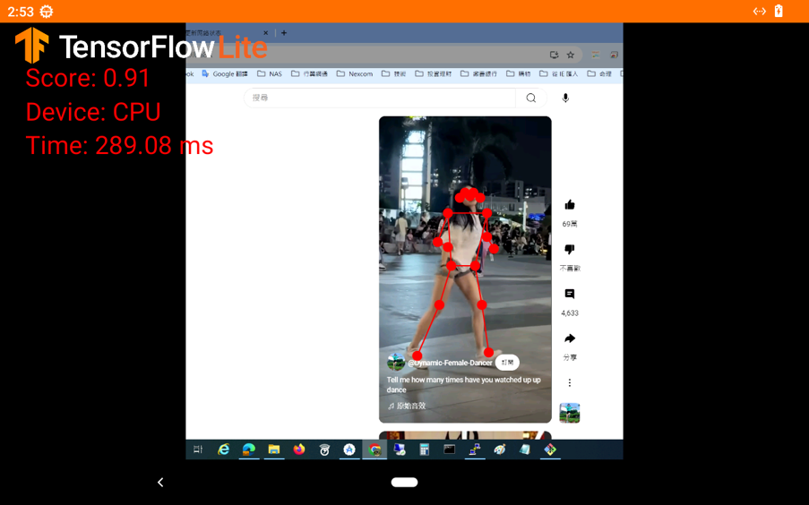

# posenet - PoseNet Demo Application

## Overview

The posenet application uses TensorFlow Lite to perform pose estimation on video input from the HDMI-IN source of the Nexcom VMC320 vehicle mount computer. It detects and tracks human poses in real-time.

## Features

- **Pose Estimation:** Uses TensorFlow Lite to estimate human poses in real-time.
- **HDMI-IN Source:** Processes video input from an HDMI source.
- **Real-time Tracking:** Displays detected poses on the video feed.

## Screenshot

## Getting Started

1. Clone the repository: `git clone https://github.com/KevincyCheng/VMC320.Android.git`
2. Navigate to the posenet directory: `cd VMC320.Android/posenet`
3. Open the project in Android Studio.
4. Build and run the application on your VMC320 device.

## Usage

- Connect an HDMI source to the VMC320 device.
- Launch the posenet app to start the pose estimation demo.
- Observe the detected poses overlaid on the video feed.

## Contributing

Contributions are welcome! Please fork the repository and submit pull requests for any improvements or bug fixes.

